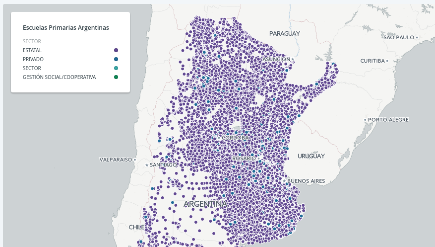
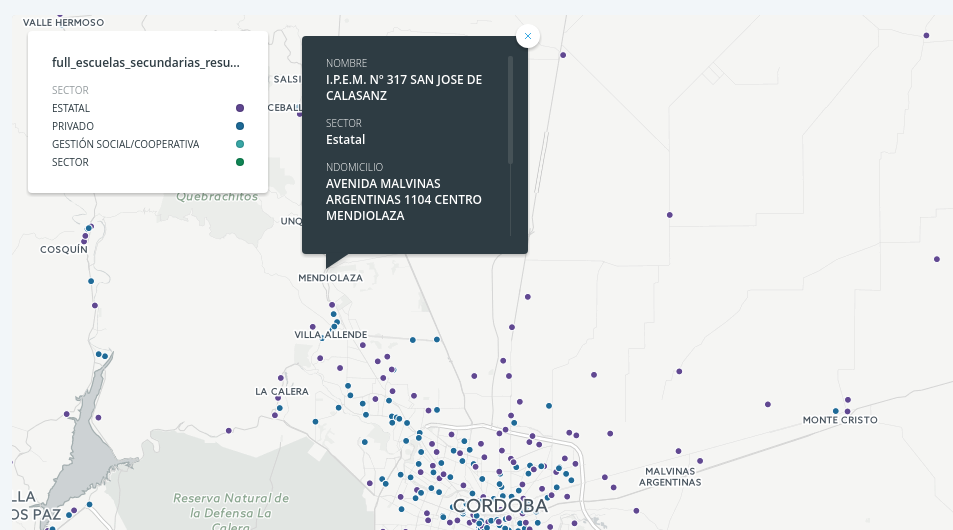

# Datos abiertos de escuelas argentinas

Con información provista por [Manuel Aristarán](https://twitter.com/manuelaristaran) ([Donde voto?](https://github.com/jazzido/dondevoto)) y [Gastón Ávila](https://twitter.com/avilagas)

Nuestro mapa de educación nacional incluye [un WFS abierto y disponible](http://mapa.educacion.gob.ar/geoserver/web/?wicket:bookmarkablePage=:org.geoserver.web.demo.MapPreviewPage).  

 

## Scripts

Con este servicio es posible extraer listas geolocalizadas de instituciones educativas.  
En el directorio scripts se incluyen herramientas para:
 - Obtener un SHP de +60.000 escuelas [VER SCRIPT](scripts/get-shapes.sh)
 - Obtener un CSV de +60.000 escuelas [VER SCRIPT](scripts/get-escuelas.sh)
 - Obtener un CSV de +22.000 escuelas primarias [VER SCRIPT](scripts/get-escuelas-primarias.sh)
 - Obtener un CSV de +13.000 escuelas secundarias [VER SCRIPT](scripts/get-escuelas-secundarias.sh)

## Datasets

Quedan subidos en la carpeta _datos_ versiones resumidas de los datasets para usar.  

## Datos

Estas listas incluyen muchas más información que solo la geolocalización y el nombre. Informe sobre los servicios que se brindan (idiomas, bibliotecas, internet, etc).  

Los campos del dataset de +60.000 escuelas son:

```
FID,gid,provincia,cueanexo,nombre,sector,estado_codigo,ambito,ndomicilio,cod_postal,telefono,
    cod_loc,localidad,cod_depto,departamento,email,funcionamiento,comun,especial,adultos,
    artistica,hospitalaria,intercultural,encierro,maternal,infantes,ini_ambos,comun_primaria6,
    comun_primaria7,comun_cb,comun_co,comun_ambos,comun_snu,tecnica_inet,formacion_docente,
    snu_tecnico_profesional,snu_ambos,snu_sin_info,artistica_secundaria,artistica_snu,
    artistica_talleres,especial_educacion_temprana,especial_inicial,especial_primaria,
    especial_secundaria,especial_taller_integral,especial_integracion,adultos_primaria,
    adultos_egb3,adultos_secundaria,adultos_alfabetizacion,formacion_profesional,
    servicios_complementarios,cod_gis,cod_muni,rural,adultos_alf_term,
    adultos_sec_distancia,internet,internet_gratuito,internet_pago,cooperador,
    subvencion,ingles,frances,portugues,italiano,aleman,hebreo,indigena,otro,
    biblioteca,sitio,director,dni_direct,tel_direct,comun_primaria,comun_secundaria,
    comun_inicial,comun_jardin_maternal,estado,sector_detalle,cod_prov,region_cfe,
    ambito_texto,the_geom,x,y,ubicacion
```

Es un dataset muy útil. Tomando una versión resumida se elaboraron algunos mapas útiles.  

## Mapas

## Mapa de escuelas primarias

Escuelas **primarias** argentinas por sector. [VER MAPA](https://hudson.carto.com/builder/303023ef-9cc2-48d8-a72c-341eb47afd3b/embed).  



## Mapa de escuelas secundarias

Escuelas **secundarias** argentinas por sector. [VER MAPA](https://hudson.carto.com/builder/57e3d376-df28-4e5c-b668-64407a915731/embed).  




