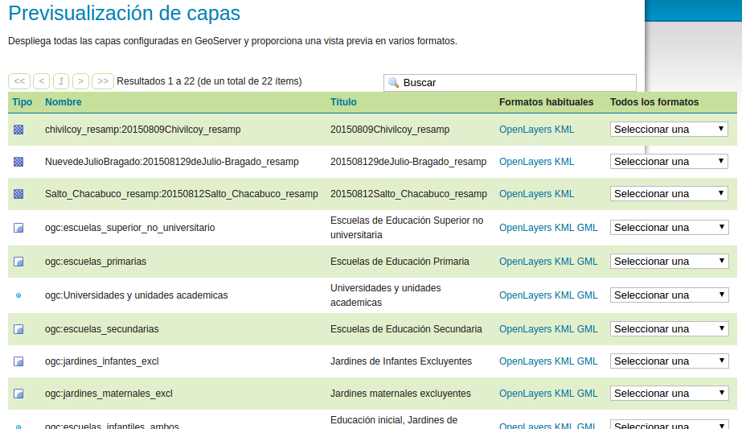

# Datos abiertos de escuelas argentinas

Nuestro mapa de educación nacional incluye [un WFS abierto y disponible](http://mapa.educacion.gob.ar/geoserver/web/?wicket:bookmarkablePage=:org.geoserver.web.demo.MapPreviewPage).  

 

## Scripts

Con este servicio es posible extraer listas geolocalizadas de instituciones educativas.  
En el directorio scripts se incluyen herramientas para:
 - Objeter un SHP de +60.000 escuelas [VER SCRIPT](scripts/get-shapes.sh)
 - Objeter un CSV de +22.000 escuelas primarias [VER SCRIPT](scripts/get-escuelas-primarias.sh)
 - Objeter un SHP de +13.000 escuelas secundarias [VER SCRIPT](scripts/get-escuelas-secundarias.sh)